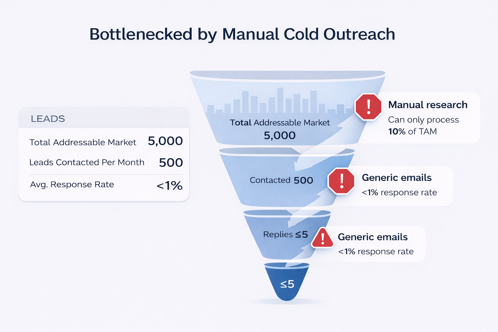
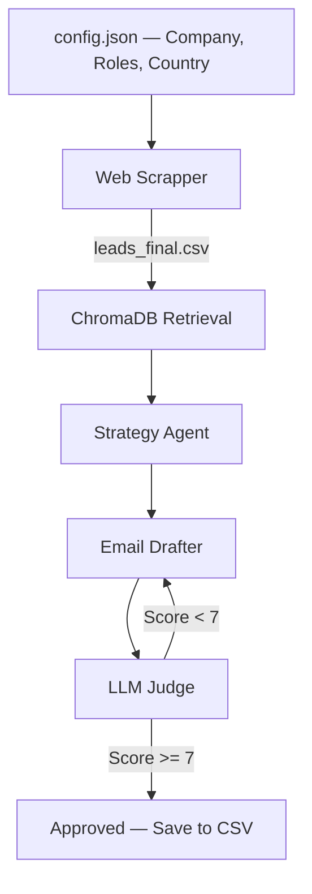

# Project SPEAR — Strategic Personalized Engagement & Acquisition Resource

<p align="center">
  
</p>

> An autonomous AI engine that replaces a 5-person marketing team — generating hyper-personalized B2B outreach emails at 10x the volume and 20% of the cost.

---

## Problem

<p align="center">
  
</p>

EXL Services identified **5,000+ high-value targets** across major banks — but the manual team could only reach **500 leads/month** (10% of TAM). To hit volume, they relied on generic templates yielding **<1% response rates**.

**Result:** 90% of leads left untouched. The other 10% burned with bad outreach.

---

## Solution

Project SPEAR automates the entire outreach pipeline with **5 AI agents**, each mirroring a real marketing team role:

| Agent | Role | Tool |
|-------|------|------|
| **The Research Lead** | Scrapes LinkedIn via Google, extracts structured lead profiles | Serper API + GPT-4.1-mini |
| **The Knowledge Specialist** | Retrieves the most relevant EXL case studies for each lead | ChromaDB + text-embedding-ada-002 |
| **The Account Strategist** | Crafts a seniority-aware strategy brief (pain point, value angle, tone) | GPT-4.1 |
| **The Writer** | Drafts a 120-170 word personalized email with strict anti-hallucination rules | GPT-4.1 |
| **The QA Lead** | Scores on a 10-point rubric; loops back to the Writer if score < 7 (max 3 tries) | GPT-4.1 + LangGraph conditional routing |

---

## Pipeline Architecture



**Orchestrator:** `Main_notebook.py` runs all 3 stages sequentially via subprocess.
**Agentic loop:** Built with **LangGraph** — the Judge node conditionally routes back to the Drafter until quality threshold is met or max iterations hit.

---

## Example Output

**Input:** Chintan Singh, VP Quantitative Research @ JP Morgan

**Strategy Brief:**
> Pain point: Managing model performance and risk at scale while keeping trading algorithms competitive.
> Lead with: EXL's Quantitative Trading Strategies work — mirrors his world of back-testing and automation.
> Tone: Peer-to-peer, analytical. He's a quant — no fluff.

**Generated Email:**
> *Subject: Automating quant signal generation — what we built for a hedge fund*
>
> Hi Chintan,
> Moving from manual back-testing to fully automated signal generation is one of the bigger operational challenges for quant research teams running multiple strategies simultaneously...

**Judge Score:** 7.0/10 — Approved after 2 iterations.

---

## Impact

| Metric | Manual Team (Current) | Project SPEAR (Future) |
|--------|----------------------|----------------------|
| Monthly Outreach | 500 Leads | 5,000 Leads |
| Personalization | Low (Templates) | High (1-to-1 Strategy) |
| Monthly Meetings | ~5 | ~50 |
| Annual Pipeline | $2.5M per Cohort | $25M per Cohort |
| Cost | $30,000/year | $5,000/year |

> Even at a conservative 20% close rate, Project SPEAR has the potential to generate **$5M in net new revenue annually**.

---

## Tech Stack

- **Orchestration:** LangGraph (stateful agent graph with conditional routing)
- **LLMs:** Azure OpenAI GPT-4.1 (strategy, drafting, judging) + GPT-4.1-mini (data extraction)
- **Vector DB:** ChromaDB with cosine similarity search
- **Embeddings:** Azure text-embedding-ada-002
- **Web Scraping:** Serper API (Google search for LinkedIn profiles)
- **Language:** Python, Pandas

---

## Project Structure

```
Project_spear/
├── Main_notebook.py          # Orchestrator — runs the full pipeline
├── Web_Scrapper.py           # Stage 1: Scrape + enrich LinkedIn leads
├── Database_creation.py      # Stage 2: Embed case studies into ChromaDB
├── Agent_notebook.py         # Stage 3: LangGraph email agent pipeline
├── config.json               # Run parameters (company, roles, models)
├── requirements.txt          # Python dependencies
├── Raw_casestudies/          # 9 EXL case study markdown files
│   ├── exl_quantitative_trading_strategies.md
│   ├── exl_credit_risk_leaders_vs_laggards.md
│   ├── exl_master_data_management.md
│   └── ... (6 more)
├── chroma_db/                # Generated vector database (gitignored)
├── outputs/                  # Generated CSVs (gitignored)
└── .env                      # API keys (gitignored)
```

---

## Setup

```bash
pip install -r requirements.txt
```

Create a `.env` file with your API keys:
```
AZURE_OPENAI_KEY=your_key
AZURE_EMBEDDING_KEY=your_key
SERPER_API_KEY=your_key
```

Edit `config.json` to set your target company, roles, and country, then run:
```bash
python Main_notebook.py
```

---

## Author

**Justin Varghese** — Data Scientist
[LinkedIn](https://www.linkedin.com/in/justin4) | [GitHub](https://github.com/blacckbeard4)
